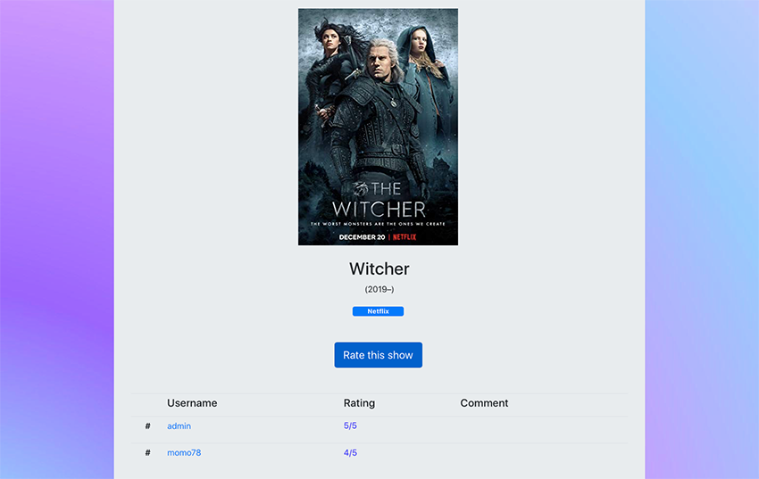
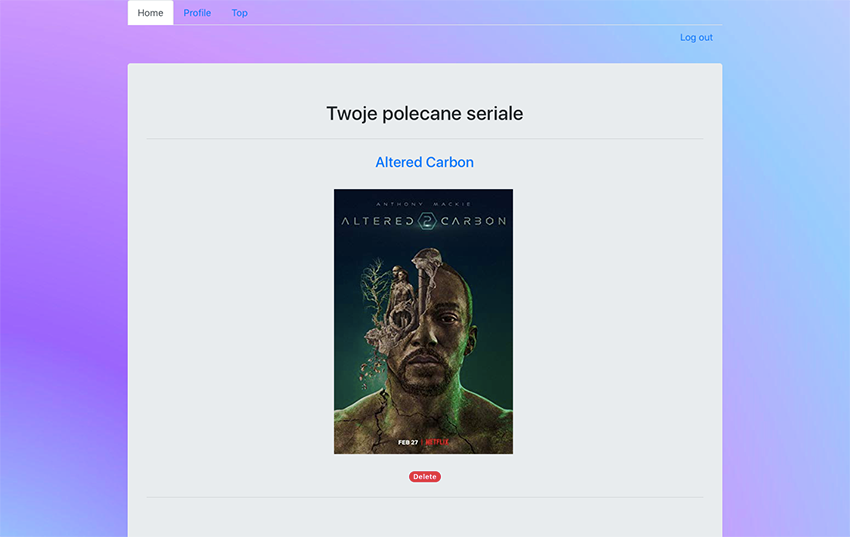
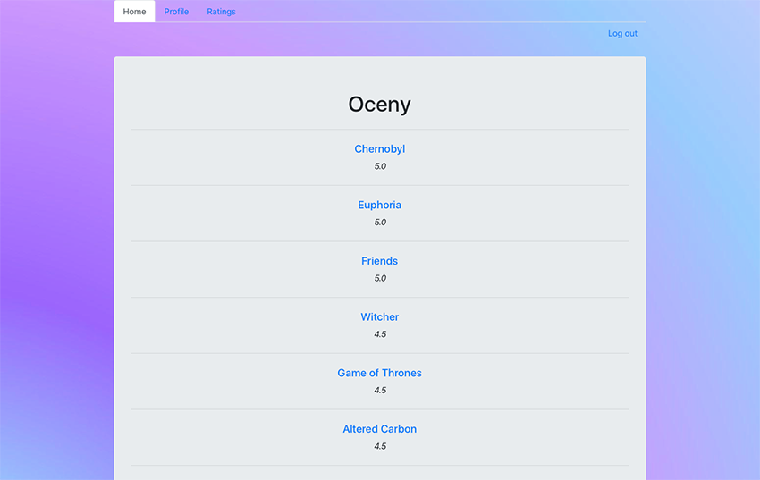

# rating_series
Web app, where users can:
- search for series by title,
- rate watched series,
- add series to personal recommendations set,
- delete series from personal recommendations set,
- view others sets and general top rated series.

Main page:

Show and rate page:

Recommendations page:

Ratings page:

Project include:
- Python
- Django
- Rest framework
- API - http://www.omdbapi.com/
- Frontend in Bootstrap
- Background image - https://wallpapercave.com/wp/UtwFDMx.jpg
